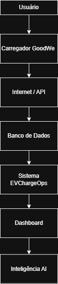

# EV ChargeOps

## Integrante

- Pedro Miguel Ribeiro – RM 569768

---

# Enterprise Challenge 2026 – GoodWe

## Descrição do Problema

Com o crescimento dos veículos elétricos, condomínios, empresas e universidades passaram a utilizar carregadores compartilhados. Entretanto, muitos desses locais não possuem sistemas capazes de identificar usuários, medir o consumo individual e realizar cobranças justas.

Dessa forma, surge a necessidade de uma plataforma capaz de gerenciar as sessões de recarga, organizar os dados gerados e fornecer informações úteis para usuários e gestores.

---

## Objetivo da Solução

Desenvolver uma plataforma chamada **EV ChargeOps**, capaz de:

- Registrar sessões de recarga;
- Identificar usuários;
- Calcular o consumo individual;
- Realizar o rateio automático da energia;
- Gerar relatórios;
- Utilizar Inteligência Artificial para análise dos dados.

---

# Frente 1 – Contexto e Problema

## Contexto

Nos últimos anos, o mercado de veículos elétricos apresentou um crescimento significativo no Brasil e no mundo. Com isso, aumentou também a necessidade de infraestrutura de recarga em condomínios, empresas e instituições de ensino.

Em muitos desses ambientes, os carregadores são compartilhados entre vários usuários, gerando dificuldades no controle de consumo e na divisão dos custos de energia.

## Problema Identificado

Os principais problemas encontrados são:

* Falta de identificação dos usuários que realizam as recargas;
* Dificuldade em medir o consumo individual de energia;
* Ausência de um sistema de rateio automático;
* Falta de relatórios e indicadores de utilização;
* Dificuldade na gestão dos carregadores compartilhados.

## Proposta de Solução

O projeto EV ChargeOps propõe o desenvolvimento de uma plataforma capaz de registrar as sessões de recarga, armazenar informações de consumo, gerar relatórios e utilizar Inteligência Artificial para fornecer análises e previsões sobre o uso dos carregadores.

---

# Frente 2 – Base Técnica e Regulatória

## Resolução Normativa ANEEL nº 1.000/2021

A Resolução Normativa nº 1.000/2021 da ANEEL estabelece as condições gerais para o fornecimento de energia elétrica no Brasil. Em relação aos veículos elétricos, a norma permite a instalação de infraestrutura de recarga e a exploração comercial do serviço, desde que sejam observadas as exigências da distribuidora de energia e as normas técnicas vigentes.

A regulamentação também incentiva o uso de tecnologias que permitam a medição individualizada do consumo e o monitoramento das sessões de recarga, fatores essenciais para o funcionamento da plataforma EV ChargeOps.

---

## Carregador GoodWe HCA G2

O carregador GoodWe HCA G2 possui diversas interfaces de comunicação que possibilitam a integração com sistemas de gerenciamento.

| Interface | Função                                                   |
| --------- | -------------------------------------------------------- |
| Wi-Fi     | Comunicação com a internet e envio de dados para a nuvem |
| LAN       | Conexão por rede cabeada                                 |
| Bluetooth | Configuração local do equipamento                        |
| RFID      | Identificação e autenticação de usuários                 |
| RS-485    | Comunicação com outros equipamentos e sistemas externos  |

Essas interfaces permitem que os dados das sessões de recarga sejam coletados e utilizados pela plataforma.

---

## API GoodWe (SEMS Portal)

A API do SEMS Portal disponibiliza informações importantes para o gerenciamento do carregador, como:

* Status do carregador;
* Potência instantânea;
* Energia consumida;
* Histórico de sessões;
* Eventos e registros de operação.

Esses dados podem ser utilizados pelo EV ChargeOps para gerar relatórios, calcular o rateio de energia e alimentar os modelos de Inteligência Artificial.

---

## Opção de Aprofundamento Escolhida

### Exploração da API GoodWe

A plataforma utilizará a API do SEMS Portal para coletar automaticamente os dados de carregamento.

Os principais dados utilizados serão:

* Identificação da sessão;
* Horário de início e término;
* Energia consumida (kWh);
* Potência de carregamento;
* Identificação do usuário.

Essas informações serão armazenadas em banco de dados e utilizadas para geração de faturas e análises inteligentes.

---

# Frente 3 – Arquitetura e IA

## Arquitetura da Plataforma

## Diagrama de Arquitetura

A plataforma EV ChargeOps será dividida em quatro camadas:

### 1. Camada Física

Composta pelo carregador GoodWe HCA G2, responsável por fornecer energia aos veículos elétricos e gerar dados das sessões de carregamento.

### 2. Camada de Conectividade

Responsável pela transmissão das informações utilizando Wi-Fi, LAN, Bluetooth e protocolos de comunicação do carregador.

### 3. Camada de Aplicação

Responsável pelo processamento das informações, regras de negócio, cálculo de rateio e execução dos algoritmos de Inteligência Artificial.

### 4. Camada de Apresentação

Interface utilizada pelos administradores e usuários para visualizar relatórios, consumo, histórico de recargas e faturas.

---

## Fluxo de Dados

1. O usuário conecta o veículo ao carregador.
2. O carregador inicia a sessão de recarga.
3. Os dados são enviados para a API da GoodWe.
4. A plataforma EV ChargeOps recebe e armazena as informações.
5. O sistema calcula o consumo individual e o rateio.
6. Os dados são analisados pela Inteligência Artificial.
7. O usuário visualiza as informações pelo sistema.

---

## Modelo de Rateio

O modelo proposto será baseado no consumo individual de energia.

Exemplo:

| Usuário   | Consumo |
| --------- | ------- |
| Usuário A | 50 kWh  |
| Usuário B | 30 kWh  |
| Usuário C | 20 kWh  |

Caso a conta de energia seja de R$ 1.000,00:

* Usuário A: R$ 500,00
* Usuário B: R$ 300,00
* Usuário C: R$ 200,00

Esse modelo garante uma divisão proporcional ao consumo de cada usuário.

---

## Papel da Inteligência Artificial

A Inteligência Artificial terá papel estrutural na solução, sendo utilizada em duas principais funcionalidades:

### Previsão de Consumo

Utilização de modelos preditivos para estimar o consumo futuro de energia e auxiliar no planejamento da infraestrutura.

### Detecção de Anomalias

Identificação de comportamentos incomuns, como:

* Consumo excessivo;
* Falhas de carregamento;
* Uso indevido do equipamento;
* Picos anormais de energia.

Essas análises auxiliam gestores na tomada de decisão e tornam a plataforma mais inteligente e eficiente.

---

# Plano da Sprint 2

Na segunda sprint será desenvolvido um protótipo funcional da plataforma EV ChargeOps.

As etapas previstas são:

1. Desenvolvimento do sistema de cadastro de usuários e veículos;
2. Implementação do registro de sessões de recarga;
3. Integração com a API da GoodWe;
4. Implementação do cálculo automático de rateio;
5. Desenvolvimento de dashboards e relatórios;
6. Implementação das funcionalidades de Inteligência Artificial;
7. Realização de testes e validação da solução.

## Tecnologias Pretendidas

* Front-end: HTML, CSS e JavaScript;
* Back-end: Python;
* Banco de Dados: MySQL;
* Controle de versão: Git e GitHub;
* Inteligência Artificial: bibliotecas de Machine Learning em Python.

---

# Referências

* ABVE – Associação Brasileira do Veículo Elétrico. Disponível em: https://www.abve.org.br
* ANEEL – Agência Nacional de Energia Elétrica. Disponível em: https://www.gov.br/aneel
* GoodWe – Documentação e informações técnicas. Disponível em: https://www.goodwe.com
* Open Charge Map. Disponível em: https://openchargemap.org
* Google Places API. Disponível em: https://developers.google.com/maps
* IBGE – Instituto Brasileiro de Geografia e Estatística. Disponível em: https://www.ibge.gov.br
* Kaggle – Electric Vehicle Charging Sessions Dataset. Disponível em: https://www.kaggle.com

